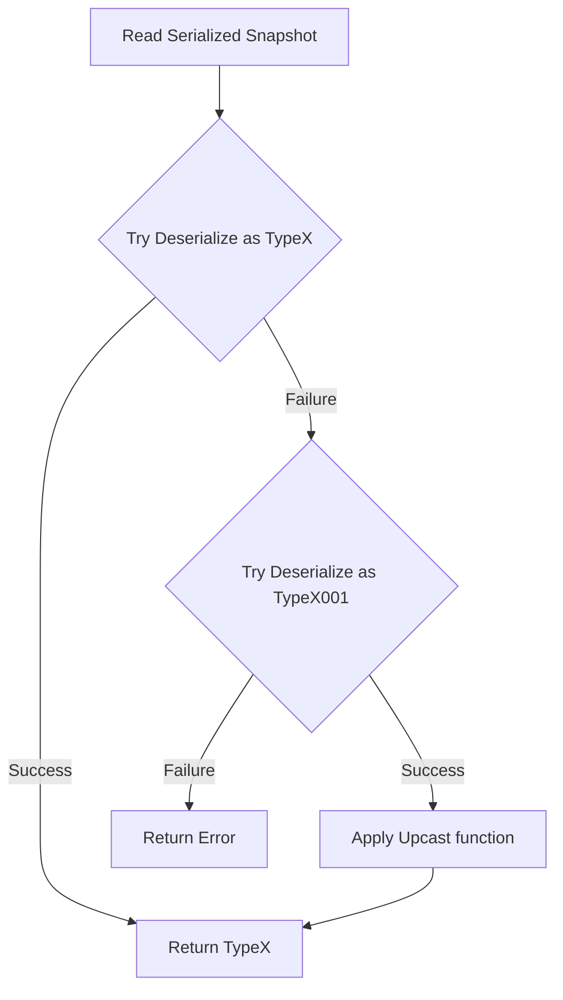

# Upcasting

As application requirements change, domain aggregates evolve. This page describes the upcasting techniques you can use to read old serialized snapshots or events into a new format in a Sharpino-based solution.

## Goal
The goal is to read the old (serialized) version of `TypeX` and deserialize it into a new version of it, without breaking history.

---

## Step-by-Step Upcasting Strategy

### 1. Maintain Serialization Compatibility
Clone your old `TypeX` into a new type with a versioned name (e.g., `TypeX001`). Your serialization library must be configured such that it can deserialize an old stored snapshot/event of `TypeX` into the equivalent instance of `TypeX001`.

### 2. Evolve the Original Type
Add new properties or modify structures on `TypeX`. Ensure that a logical conversion function exists from the old version (`TypeX001`) into the new version (`TypeX`).

### 3. Implement the Upcast Member
Define an `Upcast` member or function on `TypeX001` that converts it into the new `TypeX`.

### 4. Configure Fallback Deserialization
In your deserialization logic for `TypeX`, handle failures by attempting to deserialize as `TypeX001` and upcasting:



```fsharp
// Example conceptual pattern
let deserializeTypeX (serializedData: byte[]) =
    match tryDeserialize<'TypeX> serializedData with
    | Ok state -> Ok state
    | Error _ ->
        match tryDeserialize<'TypeX001> serializedData with
        | Ok oldState -> Ok (oldState.Upcast())
        | Error err -> Error err
```

---

## Upcasting Snapshots in Bulk (Recommended)

To avoid maintaining a complex, recursive chain of versioned types (e.g., `TypeX001`, `TypeX002`) and upcasting logic indefinitely:

1. **Massive Upcast & Re-snapshot:** In your update migration, retrieve the current states of all aggregates. Under the hood, this reads old snapshots and applies the upcasting on the fly.
2. **Commit New Snapshots:** Call `mkAggregateSnapshots` or `mkSnapshots` to write new snapshots for all active aggregates in the new `TypeX` format.
3. **Clean Up Code:** Once all active snapshots are saved in the new format, you can safely remove the legacy types and fallback upcasting code from your application.
