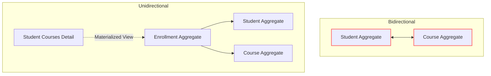
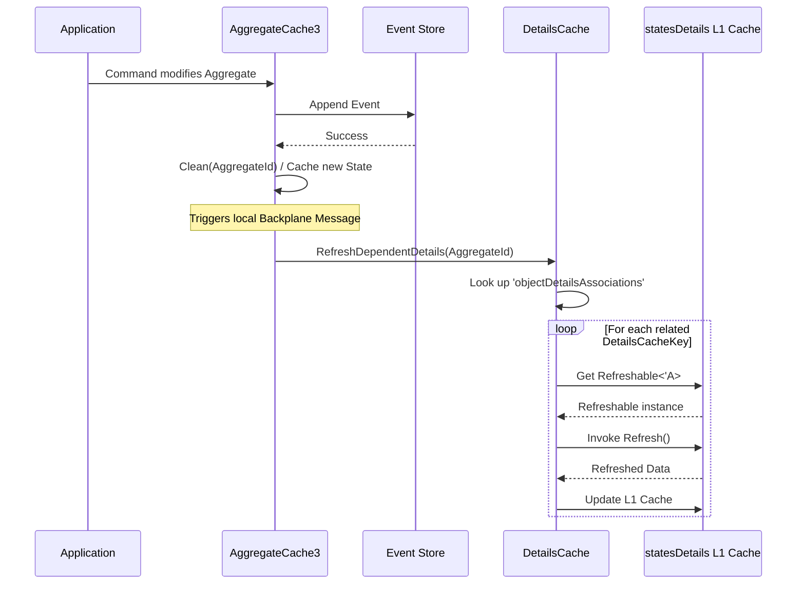
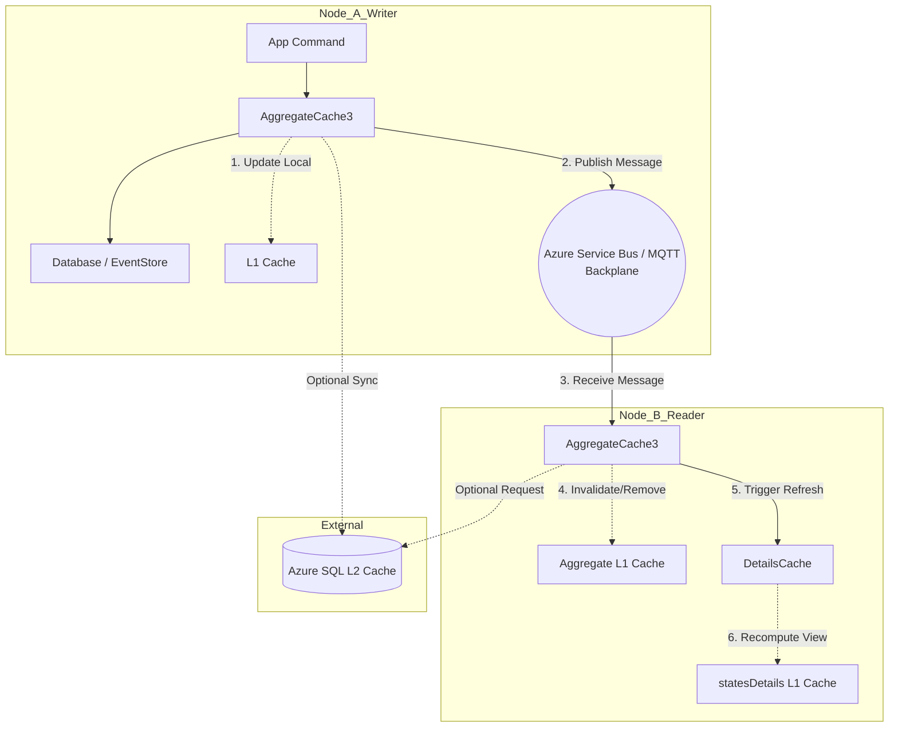

# Caching Architecture: Aggregates, Details, and Backplanes

This document outlines the caching architecture within the Sharpino project, detailing the handling of domain aggregates, materialized read-model views (Details), and the mechanisms used to keep them consistently synchronized across distributed instances utilizing an L2 Cache and a message backplane.

## 1. The Context: Cross-Stream Invariants and Unidirectional Design

In an Event Sourced system where domain events are first-class citizens, a recurring challenge is dealing with cross-stream invariants—rules that span across multiple aggregate streams (e.g., ensuring a bidirectional relationship between `Course` and `Student` remains consistent). Maintaining these invariants purely through distributed transactional events can quickly become complex, expensive, and fragile.

As a solution, Sharpino advocates for a **unidirectional design approach**. Instead of enforcing mutual invariants directly between multiple associated aggregates, a single aggregate acts as the source of truth for the relationship. 

However, this simplification imposes a cost on querying and navigation. To efficiently retrieve relational data (e.g., "all courses for a student"), we must rely on **Materialized Views**, referred to in Sharpino as **Details**.

---

## 2. Refreshable Details: Keeping Aggregates and Details in Sync

The relation between Aggregates and their resulting view models (Details) revolves around the concept of **Refreshable Details**. 

A `Detail` is essentially an in-memory materialized view optimized for the read-side. To ensure these views do not drift out of sync when their underlying Aggregates emit new events, they are implemented using the `Refreshable<'A>` interface. 

When a component of a Detail depends on an Aggregate, an association is recorded between the `AggregateId` and the specific `DetailsCacheKey` that represents the materialized view. Whenever the Aggregate produces an event modifying its state, the system reacts by triggering a refresh of all corresponding dependent Details (`RefreshDependentDetails`). This localized reactivity guarantees that our high-performance read models are kept consistently synced with the write-side Event Store.

### Refreshable Details Flow

This diagram shows how emitting an event triggers the dependent details to refresh:

---

## 3. Cache for Aggregates (`AggregateCache3`)

Reconstituting an aggregate state from a long stream of events can be costly if done for every command or read request. Sharpino implements an `AggregateCache3` to address this:

- **Primary Role:** It memoizes the most recent calculated state of an aggregate (`Result<EventId * obj, string>`) to dramatically speed up subsequent command evaluations.
- **Cache Lifecycle:** State is cached per `AggregateId`. Upon emitting a new event, the cached state is updated or invalidated (`Clean`).
- **Distributed Ready:** It seamlessly integrates with a Level 2 (L2) Distributed Cache (e.g., SQL Server Cache) ensuring that the processing load of aggregate reconstruction is shared and minimized across multiple nodes.

---

## 4. Cache for Details (`DetailsCache`)

The `DetailsCache` is responsible for storing the computed `Refreshable` states and navigating the links between Aggregates and Details.

It internally operates two distinct caches:
1. **`statesDetails`:** Stores the actual materialized view objects (wrapped in closures). Notably, because these objects often contain `System.Type` references or active closures that cannot easily be JSON serialized, this cache **intentionally avoids L2 distribution**. It is purely a fast, in-memory Level 1 (L1) cache.
2. **`objectDetailsAssociationsCache`:** Stores the mappings (`List<DetailsCacheKey>`) dependent on any given `AggregateId`. Because this entails simple, serializable data, it is safely persisted in the L2 Distributed Cache, allowing multiple nodes to understand aggregate dependencies.

When `RefreshDependentDetails(aggregateId)` is triggered, the `DetailsCache`:
1. Looks up the association cache to find all `DetailsCacheKey`s bound to the aggregate.
2. Invokes the `Refresh()` mechanism on each corresponding `Refreshable`.
3. If the refresh succeeds, updates the `statesDetails` L1 cache. If it fails (e.g., indicating the referenced data was destroyed), the entry is safely evicted.

---

## 5. Distributed Cache & Backplane Synchronization

To support horizontal scaling, Sharpino instruments its cache layers (using `FusionCache`) with an **L2 Cache** and a **Backplane**.

### L2 Cache Integration
Sharpino can hook into a distributed cache (configured for Azure SQL Server via `setupAzureSqlCache`). 
An important operational characteristic defined in the configuration is that the **L2 Time-to-Live (TTL) is strictly shorter than the L1 TTL**. This design averts situations where stale L2 distributed entries mistakenly pollute fresh L1 caches when application nodes are restarted.

### Message Backplane Synchronization
Relying solely on an L2 cache can lead to brief windows of inconsistency between nodes. A Backplane (using Azure Service Bus or MQTT) is implemented to broadcast immediate cache mutations (Sets/Removes).

1. **Publishing:** When an Aggregate state is evicted (`Clean`) or a Detail is updated in the local L1 Cache, the system fires an `EntrySet` or `EntryRemove` message to the Backplane.
2. **Receiving and Reacting:** Other nodes listening to the Backplane receive these messages and react:
   - For `AggregateCache3`: If a node receives a removal/update notification for an aggregate from another instance, it explicitly invalidates its own local L1 cache for that aggregate.
   - **Crucially, it also automatically extracts the `AggregateId` and invokes `DetailsCache.Instance.RefreshDependentDetails(guidKey)`**.
    
This interconnected behavior guarantees that an action occurring on Node A will not only drop the stale aggregate on Node B but will automatically instruct Node B to eagerly rebuild or evict any locally mapped Refreshable Details linked to that Aggregate.
