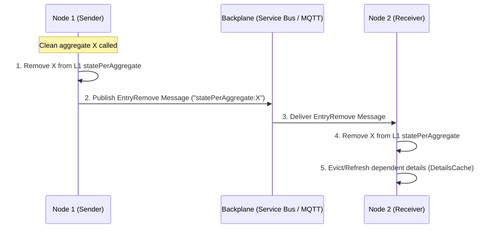
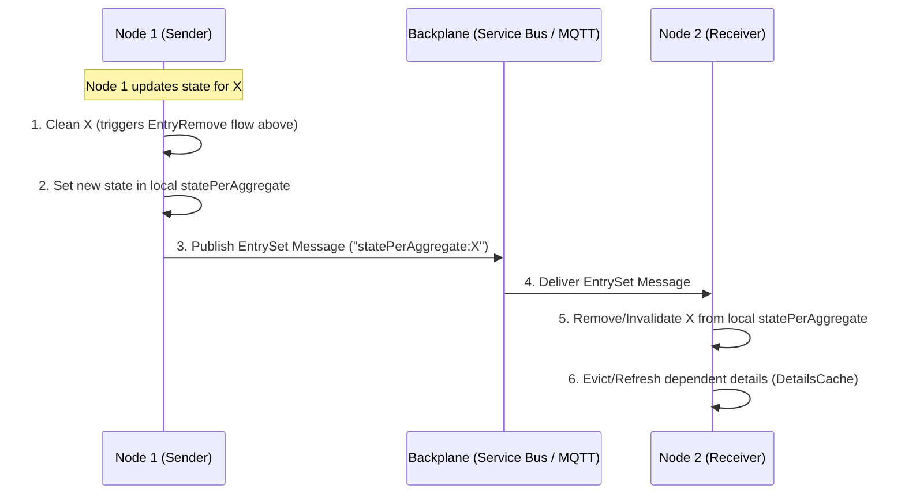

# Cache Invalidation & L2 Flow Report

This report outlines the mechanisms behind cache invalidation, details the role of the L2 SQL Cache, and lists exactly what is cached at each level.

---

## 1. Cache Invalidation Flows

When an aggregate is modified, the node triggers invalidation on peers via **EntryRemove** (eviction) and **EntrySet** (state update) messages over the backplane.

### Flow A: Eviction via `Clean` (EntryRemove)


### Flow B: Memoization via `EntrySet`


### Peer node updates:
1. When peer Node 2 receives either `EntryRemove` or `EntrySet` for an aggregate key, it invalidates its local L1 cache:
   ```fsharp
   statePerAggregate.Remove(key, receiverOptions)
   ```
2. Peer Node 2 automatically extracts the aggregate `Guid` and triggers a refresh on all associated composite Details:
   ```fsharp
   DetailsCache.Instance.RefreshDependentDetailsAsync(guidKey, Some CancellationToken.None)
   ```

---

## 2. Involvement of L2 Cache in Aggregate Cache

:::note[Important]
**The L2 Cache is NOT involved in the aggregate cache (`AggregateCache3`) flow.**
:::

- `statePerAggregate` caches F# asynchronous Task objects (`Task<Result<EventId * obj, string>>`), which cannot cross process boundaries or be serialized.
- Therefore, the L2 distributed setup is commented out by design.
- Rebuilding aggregate state on cache misses relies instead on **Database Snapshots** (loaded from the DB snapshots table) and replaying only subsequent events.

---

## 3. L2 Cache Contents: What is and isn't stored?

Below is a breakdown of the caches managed in `Cache.fs` and their L2 cache eligibility:

| Cache Component | Purpose | Stored in L1? | Stored in L2? | Why / Why Not? |
| :--- | :--- | :---: | :---: | :--- |
| **`objectDetailsAssociationsCache`** | Maps aggregate IDs to lists of details keys. | **Yes** | **Yes** | Contains plain list/GUID combinations which are fully JSON-serializable. |
| **`statesDetails`** | Caches the actual projected/memoized detail values. | **Yes** | **No** | Caches `RefreshableAsync<'T>` wrappers enclosing live F# closures and type references, which cannot be serialized. |
| **`statePerAggregate`** | Caches the reconstructed aggregate states. | **Yes** | **No** | Stores `Task` objects representing the asynchronous state reconstruction, which cannot be serialized. |

## 4. Supported L2 Cache Providers

- Redis
- Sql
- Postgres

Example of how to configure L2 Cache are shown in the samples from 24 to 28.

Note: a future change will be to transform the value of the entries of the L1 cache from Task<Result<EventId * obj, string>> to  Result<EventId * obj, string> to be able to use them also in the L2 cache. This will avoid that invalidation may require event replay. 
 
