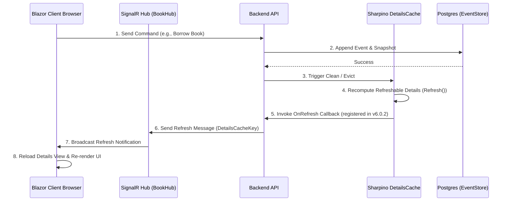

# Real-world Demo: Blazor Book Library

The **Blazor Book Library** is a fully functional reference application demonstrating the Sharpino event-sourcing backend working alongside a Blazor frontend.

- **GitHub Repository:** [tonyx/blazorBookLibrary](https://github.com/tonyx/blazorBookLibrary)
- **Live Demo Website:** [www.biblionet.eu](http://www.biblionet.eu)

---

## Architecture Overview

This project demonstrates a production-grade tech stack:
1. **Frontend:** Blazor WebAssembly/Server displaying book catalogs, reservations, and inventory.
2. **Backend:** F# API layer built on **Sharpino**.
3. **Database:** PostgreSQL storing events and snapshots.
4. **Real-time Sync:** **SignalR** integrated directly with Sharpino's **DetailsCache** to push updates to client browsers immediately when read-model details are refreshed.

---

## SignalR & `DetailsCache` Integration Flow

To ensure client pages update in real-time when underlying aggregate states change, Sharpino triggers a SignalR notification whenever dependent composite **Details** are refreshed.



---

## Implementation Details

### 1. Registering the Cache Refresh Side-Effect (F# Backend)
In Sharpino 6.0.2+, you can register a callback on cache updates. The backend hooks into this callback to publish messages to the SignalR hub context:

```fsharp
// Example backend setup registering the OnRefresh callback
let setupDetailsCacheRefreshNotification (hubContext: IHubContext<BookHub>) =
    DetailsCache.Instance.RegisterOnRefreshCallback(fun (key: DetailsCacheKey) ->
        // When a DetailsCache item is refreshed, notify all SignalR clients
        task {
            do! hubContext.Clients.All.SendAsync("ReceiveDetailsRefresh", key.Type.Name, key.Id)
        } :> Task
    )
```

### 2. Reacting to Refreshes (Blazor C# Frontend)
In your Blazor components (e.g., `BookCatalog.razor`), configure a `HubConnection` to listen for refresh events. When a refresh notification is received, invalidate local state and trigger a re-render:

```csharp
@using Microsoft.AspNetCore.SignalR.Client
@inject NavigationManager Navigation
@implements IAsyncDisposable

<h3>Book Catalog</h3>

@code {
    private HubConnection? hubConnection;

    protected override async Task OnInitializedAsync()
    {
        hubConnection = new HubConnectionBuilder()
            .WithUrl(Navigation.ToAbsoluteUri("/bookhub"))
            .WithAutomaticReconnect()
            .Build();

        hubConnection.On<string, Guid>("ReceiveDetailsRefresh", async (typeName, id) =>
        {
            if (typeName == nameof(BookDetails))
            {
                // Re-fetch the updated details view from the API
                await LoadBooks();
                
                // Request component re-render
                StateHasChanged();
            }
        });

        await hubConnection.StartAsync();
    }

    public async ValueTask DisposeAsync()
    {
        if (hubConnection is not null)
        {
            await hubConnection.DisposeAsync();
        }
    }
}
```
