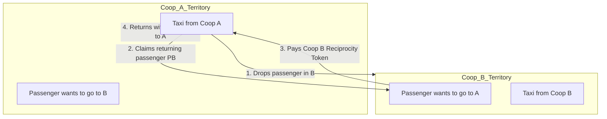

# Cooperation Demo: tit4Taxi

The **tit4Taxi** project is a runnable proof of concept demonstrating how adjacent taxi cooperatives operating in exclusive, adjacent territories can cooperate to reduce empty return trips and fuel waste.

- **GitHub Repository:** [tonyx/tit4Taxi](https://github.com/tonyx/tit4Taxi)
- **Theoretical Explanation (YouTube):** [How Taxi Cooperatives Can Cooperate](https://www.youtube.com/watch?v=rC3WaIJcx5c)
- **Research Paper (Zenodo):** [Beyond the Tragedy of the Alleged Monopoly: A Commons-Based Cooperation Model with Weighted Reciprocity in the Taxi Sector](https://zenodo.org/records/21175549)

---

## The Problem: Territorial Inefficiencies

When two taxi cooperatives (Coop A and Coop B) own exclusive transport rights in adjacent regions:
1. A taxi from Coop A drops a passenger off in Coop B's territory.
2. Under strict local regulations, the Coop A driver **cannot** pick up a passenger in Coop B's region, even if passengers are waiting to travel back to Coop A's region.
3. The Coop A driver must return empty, resulting in wasted fuel, emissions, and time.

---

## The Solution: Weighted Reciprocity Tokens

By framing the exclusive territory rights as a **commons governance** problem, `tit4Taxi` introduces a system of **Weighted Reciprocity Tokens** (a technical implementation of a *Tit-for-Tat* game theory strategy):

- **Token Economy:** Cooperatives grant each other "transportation rights tokens" to allow picking up passengers in their exclusive territories.
- **Transaction Log:** Every cross-territory pickup is recorded on the event store.
- **Balance Ledger:** A shared ledger tracks token balances. A cooperative must maintain a healthy token balance to continue using the other cooperative's roads, ensuring mutual cooperation and preventing free-riding.

---

## Architecture & Event Sourcing

Using **Sharpino**, the reciprocity token ledger is modeled as a consistent event-sourced domain:
- **Ledger Aggregate:** Tracks token transactions, pending requests, and balances between cooperatives.
